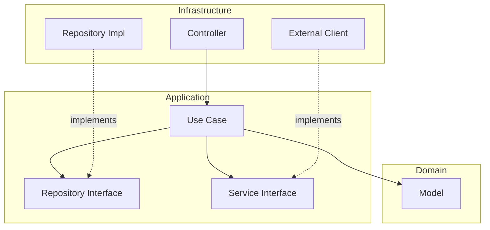

# Architecture & Standards — Core Service Template

This document defines the strict development rules for any service built on this template.
**Goal:** Zero ambiguity about file locations, pragmatic Clean Architecture, and portfolio-grade rationale.

The *why* behind each major choice is documented as Architecture Decision Records in [`docs/adr/`](./docs/adr/).

---

## Table of Contents

- [1. Philosophy](#1-philosophy)
- [2. Tech Stack](#2-tech-stack)
- [3. Folder Structure](#3-folder-structure)
- [4. The Three Layers](#4-the-three-layers)
- [5. Use Case Pattern](#5-use-case-pattern)
- [6. Error Handling](#6-error-handling)
- [7. Naming Conventions](#7-naming-conventions)
- [8. Golden Rules](#8-golden-rules)
- [9. Configuration & Secrets](#9-configuration--secrets)
- [10. Persistence & Migrations](#10-persistence--migrations)
- [11. Observability](#11-observability)
- [12. Testing Standards](#12-testing-standards)
- [13. ADR Index](#13-adr-index)

---

## 1. Philosophy

We follow **pragmatic Clean Architecture** — three layers, dependency inversion at boundaries, and deliberate deviations from the textbook when ceremony outweighs value.

* **Domain is the center.** Business entities and rules live here, and conceptually depend on nothing else. We accept JPA annotations as a deliberate tradeoff — see [ADR-0002](./docs/adr/0002-jpa-annotated-domain-entities.md).
* **Application orchestrates.** One use case per action. Interfaces for anything the use case doesn't own (repositories, external services).
* **Infrastructure adapts.** Controllers, JPA repositories, external clients — everything that touches the outside world.



Dependency direction is strict: **Infrastructure → Application → Domain**. Nothing flows the other way.

---

## 2. Tech Stack

| Category          | Tool                             |
|:------------------|:---------------------------------|
| **Language**      | Kotlin (JDK 21)                  |
| **Framework**     | Spring Boot 3.x                  |
| **Security**      | Spring Security 6                |
| **JWT**           | jjwt 0.13.x (validation only)    |
| **Database**      | PostgreSQL                       |
| **ORM**           | Spring Data JPA (Hibernate)      |
| **Migrations**    | Flyway (versioned SQL files)     |
| **Docs**          | Springdoc OpenAPI (Swagger UI)   |
| **Testing**       | JUnit 5 + MockK + Kotest asserts |
| **Observability** | Actuator + Micrometer Prometheus |
| **Logging**       | Logback + Logstash JSON encoder  |

---

## 3. Folder Structure

Feature-first organization at the top level. Cross-cutting infrastructure lives in `core/`.

```text
src/main/kotlin/com/template/core/
├── CoreApplication.kt
│
├── core/                               # Cross-cutting infrastructure
│   ├── config/                         # AppProperties, OpenApiConfig, FlywayEnvironmentListener
│   ├── exception/                      # GlobalExceptionHandler, ErrorResponse
│   ├── jwt/                            # JwtValidationFilter, JwtValidator
│   ├── security/                       # SecurityConfig
│   └── web/filter/                     # CorrelationIdFilter, RequestLoggingFilter
│
└── features/
    └── <feature-name>/                 # One folder per domain feature
        ├── domain/
        │   ├── model/                  # Business entities (JPA-annotated)
        │   └── exception/              # DomainException subclasses
        ├── application/
        │   ├── command/                # Inputs to use cases
        │   ├── result/                 # Outputs from use cases
        │   ├── repository/             # Repository interfaces
        │   └── usecase/                # One class per action
        └── infrastructure/
            ├── persistence/            # Repository implementations + JPA interfaces
            ├── scheduling/             # @Scheduled tasks
            ├── seed/                   # Dev-only seeders
            └── web/
                ├── controller/
                ├── dto/                # Request/Response (HTTP-specific)
                └── mapper/             # Request → Command, Result → Response
```

---

## 4. The Three Layers

### A. Domain — Why It's (Mostly) Pure

Contains business entities and invariants. Depends on nothing except JPA annotations.

**Goes here:** Domain entities, domain enums, `DomainException` subclasses for invariant violations.

**Does NOT go here:** Service logic, persistence concerns, DTOs, anything Spring-specific beyond JPA.

JPA annotations on domain entities is a deliberate tradeoff — see [ADR-0002](./docs/adr/0002-jpa-annotated-domain-entities.md). Every other Spring dependency stays out.

### B. Application — The Orchestration Layer

Contains use cases and the interfaces they depend on.

**Rule:** A use case owns *one action*. No `ItemService` with 12 methods.

**Goes here:**

* `usecase/` — one class per endpoint action. Public method is always `execute(command: XCommand): XResult`.
* `repository/` — interfaces the use case calls to persist/retrieve data.
* `command/` — input types.
* `result/` — output types.

### C. Infrastructure — All The Adapters

Anything that talks to the outside world.

**Goes here:**

* Controllers (HTTP adapter)
* Repository implementations (wrap Spring Data JPA)
* External clients (HTTP calls to other services)
* Security config, JWT validation
* Scheduled tasks
* Spring configuration classes

**Rule:** If it's annotated with `@Configuration`, `@RestController`, `@Component`, or imports `org.springframework.*` (except narrow `@ConfigurationProperties` classes), it lives here.

---

## 5. Use Case Pattern

Every use case follows the same shape:

```kotlin
@Service
class CreateItemUseCase(
    private val itemRepository: ItemRepository,
) {
    fun execute(command: CreateItemCommand): ItemResult {
        val item = Item.create(command.name, command.description)
        val saved = itemRepository.save(item)
        return ItemResult.from(saved)
    }
}
```

**Rules:**

1. Constructor-inject only what this use case needs. No god services.
2. `execute()` is the single public method.
3. Use cases throw domain or application exception subclasses. Controllers never see raw exceptions.
4. Use cases return a typed `Result` object — never Spring `ResponseEntity`, never HTTP-flavored DTOs.

---

## 6. Error Handling

### A. Two-Tier Exception Hierarchy

```kotlin
sealed class DomainException(message: String) : RuntimeException(message) {
    object ItemCannotBeDeleted : DomainException("...")
}

// Feature-level application exceptions live in the feature's application layer
class ItemNotFoundException(id: UUID) : RuntimeException("Item $id not found")
```

### B. Generic External Messages (Security Rule)

Clients see generic error messages. Logs get the detail. See [ADR-0003](./docs/adr/0003-generic-external-error-messages.md).

### C. Response Shape

```json
{
  "code": "NOT_FOUND",
  "message": "Resource not found",
  "timestamp": "2026-04-18T14:30:00Z",
  "correlationId": "abc-123"
}
```

The `code` is stable and safe for client-side branching. The `message` is user-displayable but intentionally vague.

---

## 7. Naming Conventions

| Type                       | Convention                         | Example                 |
|:---------------------------|:-----------------------------------|:------------------------|
| **Domain entity**          | `SimpleName`                       | `Item`                  |
| **JPA repository**         | `JpaXRepository`                   | `JpaItemRepository`     |
| **Application repo iface** | `XRepository`                      | `ItemRepository`        |
| **Repo implementation**    | `XRepositoryImpl`                  | `ItemRepositoryImpl`    |
| **Use case**               | `VerbSubjectUseCase`               | `CreateItemUseCase`     |
| **Command (input)**        | `VerbSubjectCommand`               | `CreateItemCommand`     |
| **Result (output)**        | `XResult`                          | `ItemResult`            |
| **Controller**             | `XController`                      | `ItemController`        |
| **Config properties**      | `XProperties`                      | `AppProperties`         |

---

## 8. Golden Rules

1. **Domain never imports `org.springframework.*`** except JPA.
2. **Application never imports `org.springframework.web.*` or JPA directly.**
3. **One use case = one action = one `execute()` method.**
4. **Controllers contain no business logic.** Map request → command, call use case, map result → response.
5. **No `utils` or `helpers` packages.** If it's reused, it lives in the layer it belongs to, named by its role.
6. **Every secret is a `@ConfigurationProperties` class.** No scattered `@Value`.
7. **Generic error messages externally, detailed logs internally.**
8. **Never log passwords, tokens, or secrets.**

---

## 9. Configuration & Secrets

All config via `@ConfigurationProperties` data classes bound to YAML under a prefix.

```kotlin
@ConfigurationProperties(prefix = "app")
data class AppProperties(
    val cors: CorsProperties,
    val jwt: JwtProperties,
) {
    data class CorsProperties(val allowedOrigins: List<String> = emptyList())
    data class JwtProperties(val secret: String)
}
```

**Required env vars** (documented in `.env.example`):

* `DB_HOST`, `DB_PORT`, `DB_NAME`, `DB_USER`, `DB_PASSWORD`
* `JWT_SECRET`

---

## 10. Persistence & Migrations

* **Schema tool:** Flyway
* **Location:** `src/main/resources/db/migration/`
* **Naming:** `V{version}__{description}.sql` — e.g., `V1__create_items.sql`
* **Format:** plain SQL, readable in any editor or PR diff

**Rules:**

* `spring.jpa.hibernate.ddl-auto=validate` always. Never `update` or `create`.
* New columns: always nullable or with a default, for zero-downtime deploys.

---

## 11. Observability

Exposed via Spring Boot Actuator, locked behind a separate management port in prod. See [ADR-0004](./docs/adr/0004-observability-via-actuator.md).

| Concern                   | Endpoint                     | Use                             |
|:--------------------------|:-----------------------------|:--------------------------------|
| Liveness (is it up?)      | `/actuator/health/liveness`  | K8s / Docker healthcheck        |
| Readiness (can serve?)    | `/actuator/health/readiness` | K8s / LB readiness check        |
| Prometheus metrics        | `/actuator/prometheus`       | Scraped by Prometheus           |
| Runtime log level control | `/actuator/loggers`          | Change verbosity without deploy |
| App info                  | `/actuator/info`             | Version, build SHA, etc.        |

### Logging

See [ADR-0005](./docs/adr/0005-logging-in-place-then-extract.md).

* **Dev:** human-readable Logback pattern.
* **Prod:** JSON via `logstash-logback-encoder` for log aggregator ingestion.
* Every request gets a correlation ID (UUID) in MDC, returned in `X-Correlation-Id` response header.
* MDC keys standard across services: `correlationId`, `userId` (when authenticated), `path`, `method`.

---

## 12. Testing Standards

### A. Naming (Backticks)

```kotlin
@Test
fun `should return not found when item does not exist`() { ... }
```

### B. AAA Pattern (Single Act)

```kotlin
@Test
fun `should save item when command is valid`() {
    // Arrange
    val useCase = createUseCase()
    every { itemRepository.save(any()) } returns savedItem

    // Act
    val result = useCase.execute(CreateItemCommand("name", "desc"))

    // Assert
    result.name shouldBe "name"
    verify { itemRepository.save(any()) }
}
```

### C. Stack

| Purpose          | Tool                                   |
|:-----------------|:---------------------------------------|
| **Runner**       | JUnit 5                                |
| **Mocking**      | MockK                                  |
| **Assertions**   | Kotest assertions                      |
| **Spring tests** | `@SpringBootTest` for controllers only |

Testcontainers is **not** included in this template — add per-project when integration tests exist.

---

## 13. ADR Index

Architecture Decision Records live in [`docs/adr/`](./docs/adr/). They document *why* each major choice was made.

1. [ADR-0001: Pragmatic Clean Architecture with Use Cases](./docs/adr/0001-pragmatic-clean-architecture.md)
2. [ADR-0002: JPA-Annotated Domain Entities](./docs/adr/0002-jpa-annotated-domain-entities.md)
3. [ADR-0003: Generic External Error Messages](./docs/adr/0003-generic-external-error-messages.md)
4. [ADR-0004: Observability via Spring Boot Actuator](./docs/adr/0004-observability-via-actuator.md)
5. [ADR-0005: Logging Built In-Place, Extracted Later](./docs/adr/0005-logging-in-place-then-extract.md)
